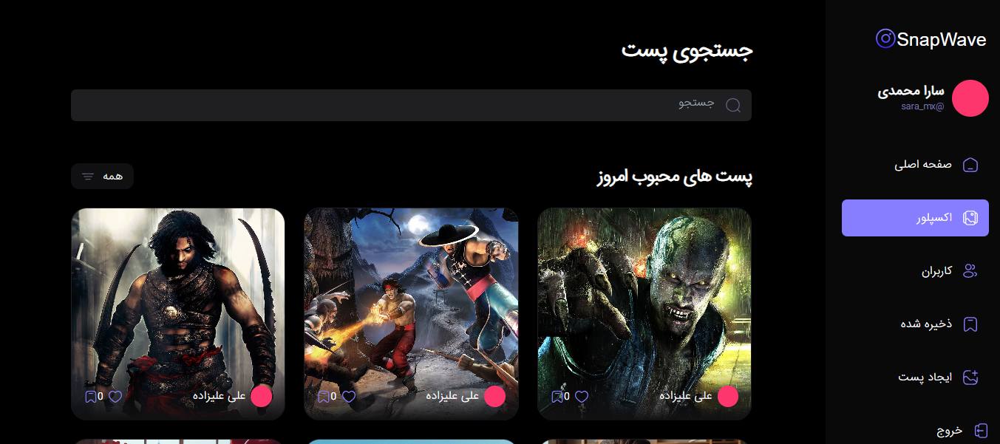
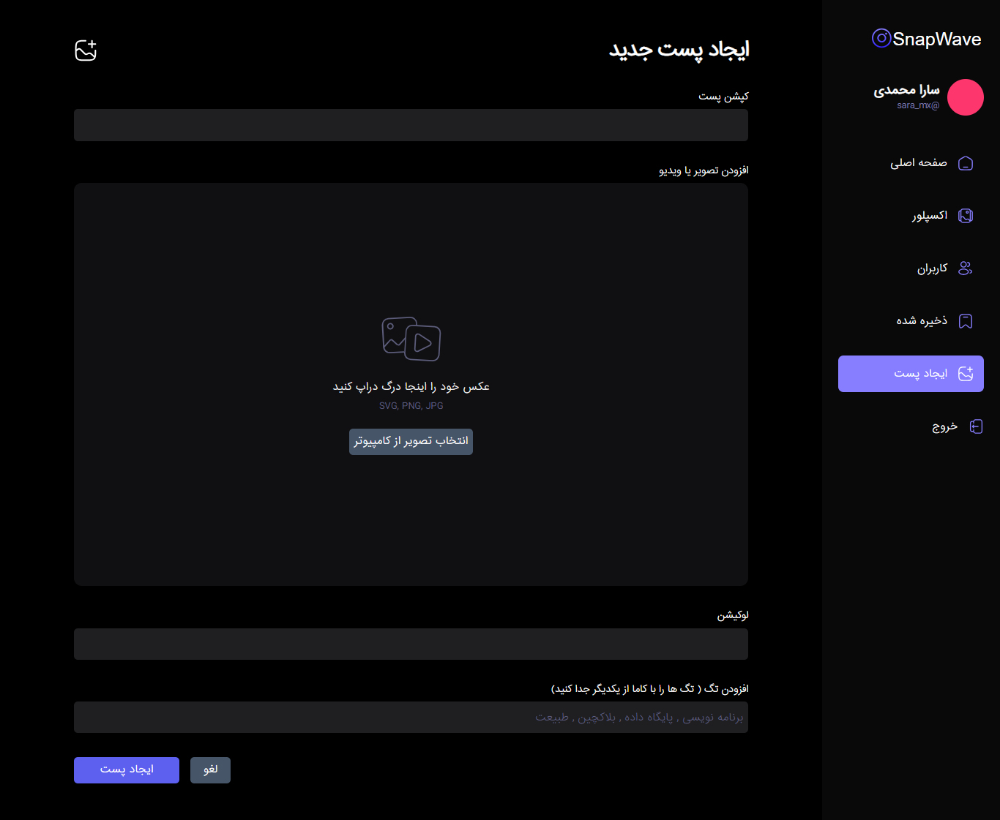
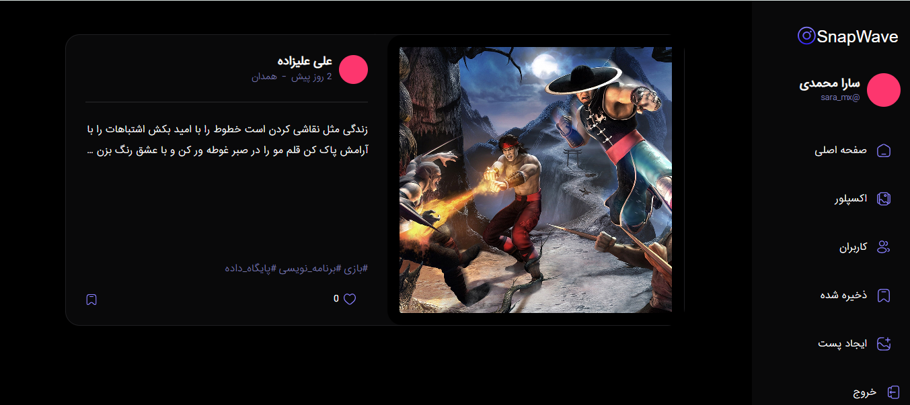
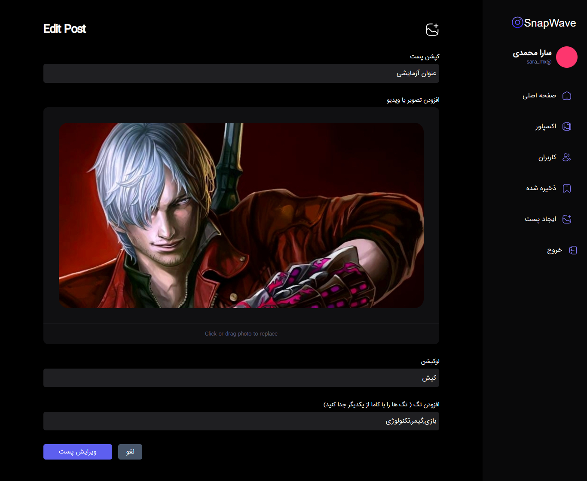

  
 
 

 

 

 

 

 

## internal pages 


## Getting Started

First, run the development server:

```bash
npm install

npm start 
# or
yarn dev
# or
pnpm dev
```

Open [http://localhost:3000](http://localhost:3000) with your browser to see the result.

You can start editing the page by modifying `app/page.tsx`. The page auto-updates as you edit the file.
 